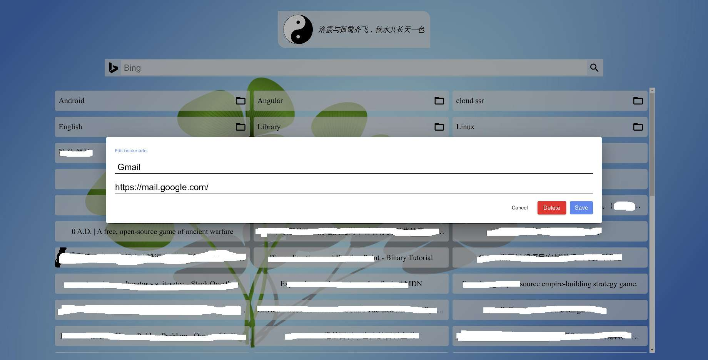

# SpeedDial

Replace firefox or chrome new tab.  

## Use

1. You can create bookmarks folder in your browser, the title is desktop-newtap; then The extension will read the folder and show it.

2. You can switch search engine, when you move mouse on the search icon(default google), you can know it.

3. If you need to save settings , you need to add a bookmark. It  address is  [https://github.com/ZTFtrue/New-Tab](https://github.com/ZTFtrue/New-Tab)  , and title is { 'theme': null, 'background': null, 'search': 1 }

4. There has other fuction ,  when you move mouse  on left-down , right-down , right-top corner.

5. you can request issues,if you have any issues. I hope this extension will make make you feel interesting.

6. It can edit bookmark , right click the bookmark by mouse.

[Install for firefox](https://addons.mozilla.org/zh-CN/firefox/addon/ztftrue-speed-dial/)  

Install for chrome, it need yo manual install.

## Manaul install

Clone or download this project,install npm package, run

```sh
npm i
# for firefox
npm run bulid
# for chrome
npm run chrome
```

open "dist/" folder.

------  

## Preview




